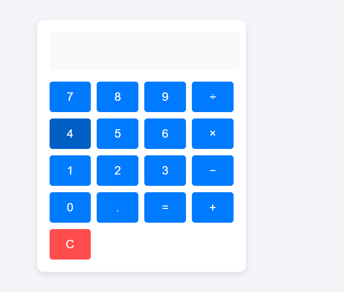
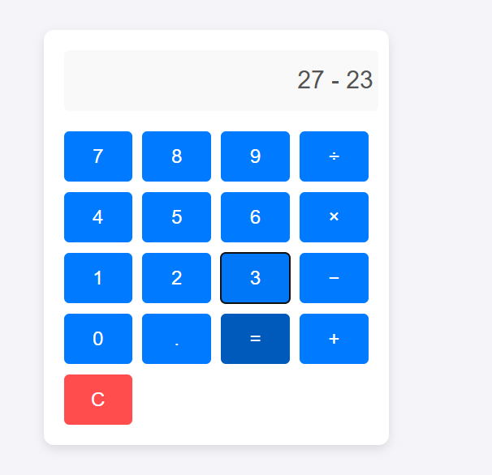
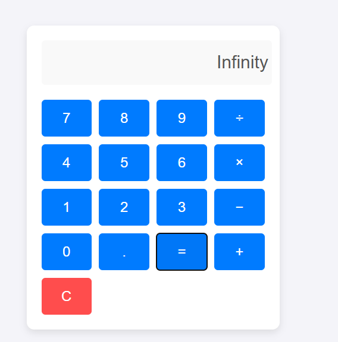

# Calculator Web Application

A simple and responsive calculator web application built using **HTML**, **CSS**, and **JavaScript**.

## Table of Contents
- [About the Project](#about-the-project)
- [Features](#features)
- [Technologies Used](#technologies-used)
- [Project Structure](#project-structure)
- [Getting Started](#getting-started)
- [How to Use](#how-to-use)
- [Screenshots](#screenshots)


## About the Project
This project is a simple calculator that can perform basic arithmetic operations like addition, subtraction, multiplication, and division. It is styled with CSS for a clean and modern look and is fully functional using JavaScript.

## Features
- Perform basic arithmetic operations (+, -, *, /).
- Decimal point support.
- Clear button to reset the calculator.
- Responsive design for different screen sizes.
- Simple and easy-to-understand code structure.

## Technologies Used
- **HTML5** – Structuring the layout.
- **CSS3** – Styling and designing the calculator.
- **JavaScript** – Adding functionality for performing calculations.

## Project Structure
```
Calculator-Project/
│
├── index.html       # HTML file for calculator layout
├── styles.css       # CSS file for styling the calculator
├── script.js        # JavaScript file for calculator functionality
```

## Getting Started
1. **Clone the repository:**
   ```bash
   git clone https://github.com/DarshanMN/calculator-project.git
   ```
2. **Navigate to the project directory:**
   ```bash
   cd calculator-project
   ```
3. **Open the `index.html` file in your browser:**
   ```
   Open index.html
   ```

## How to Use
1. Enter numbers using the buttons.
2. Click on an operator (+, -, *, /) to perform an operation.
3. Press `=` to get the result.
4. Press `C` to clear the display.

## Screenshots
### Calculator Interface


### Number Input Example



### Division by Zero Error Handling



